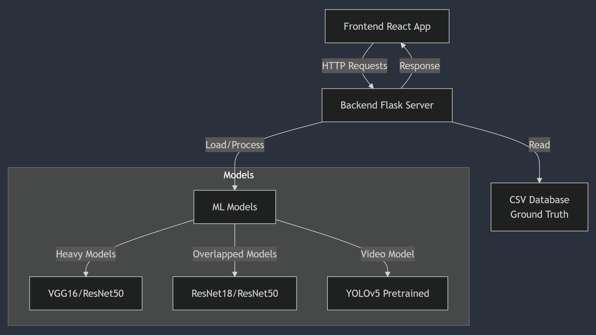

# SYSTEM DESIGN DOCUMENTATION
---
## System Architectue

* Frontend: React app handling user interactions, file uploads, and result display
* Backend: Flask server managing API endpoints, file processing, and model operations
* ML Models: Three types:
    1. Heavy Models: VGG16/ResNet50 for standard counting
    2. Overlapped Models: ResNet18/ResNet50 for crowded scenes
    3. Video Model: YOLOv5 for real-time processing
* Database: CSV storage for ground truth data
